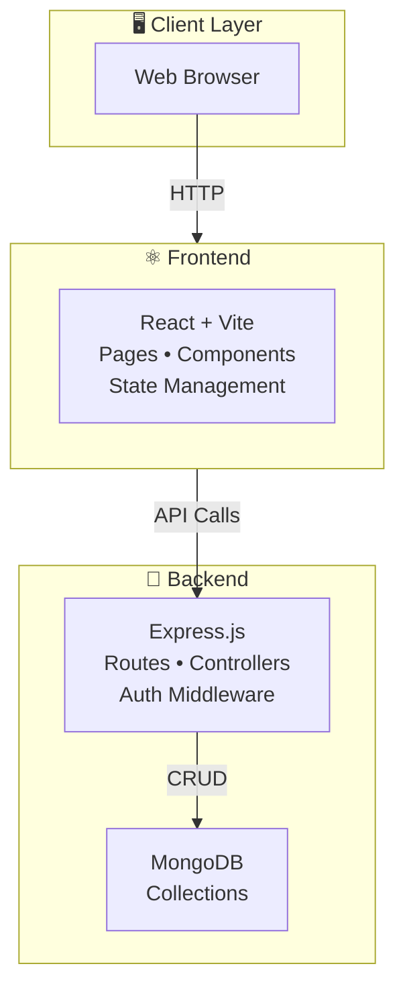

# System Architecture (Diagram)

## Overview

A full-stack web application for managing barangay events, personnel, projects, and communications with admin monitoring capabilities.

**Stack:** Node.js/Express (Backend) + React/Vite (Frontend) + MongoDB

---

## Architecture Diagram

---

## Layer Breakdown

| Layer        | Components                                | Purpose                         |
| ------------ | ----------------------------------------- | ------------------------------- |
| **Client**   | Web Browser                               | User interface access point     |
| **Frontend** | React, Vite, Components, State Management | User interaction & UI logic     |
| **API**      | Express Routes                            | HTTP endpoint definitions       |
| **Business** | Controllers & Middleware                  | Request processing & validation |
| **Data**     | Models                                    | Database schema definitions     |
| **Database** | MongoDB Collections                       | Data persistence                |

---

## Key API Endpoints

- **Auth:** `POST /users/login`, `POST /users/register`
- **Messages:** `GET/POST /messages`, `GET /messages/activities`
- **Projects:** `GET/POST /projects`, `PATCH /projects/:id`
- **Notifications:** `GET/POST /notifications`
- **SK Personnel:** `GET/POST /sk-personnel`
- **Barangay:** `GET/POST /barangay`

---

## Key Technologies

**Frontend:** React, Vite, Tailwind CSS, Axios, Lucide Icons  
**Backend:** Node.js, Express, MongoDB, JWT, Multer (file uploads)  
**Testing:** Jest (Backend), Vitest (Frontend), Cypress (E2E)

---

## Authentication Flow

1. User submits credentials → Frontend
2. Frontend sends POST to `/users/login` → Backend
3. Backend validates & returns JWT token
4. Frontend stores token in localStorage
5. All subsequent requests include JWT in header
6. Backend middleware validates token

---

## Summary

A modular, scalable barangay management system with:

- ✅ Secure user authentication
- ✅ Event and calendar management
- ✅ Personnel & project tracking
- ✅ Real-time messaging & notifications
- ✅ Admin monitoring & reporting
- ✅ File storage & management
