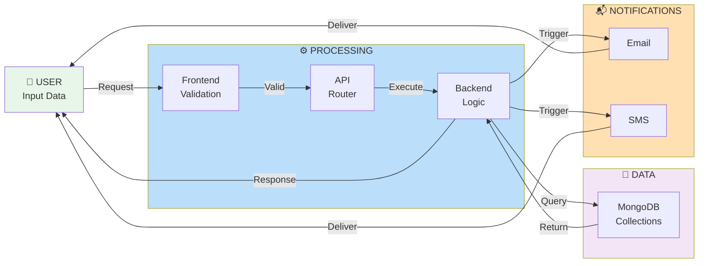
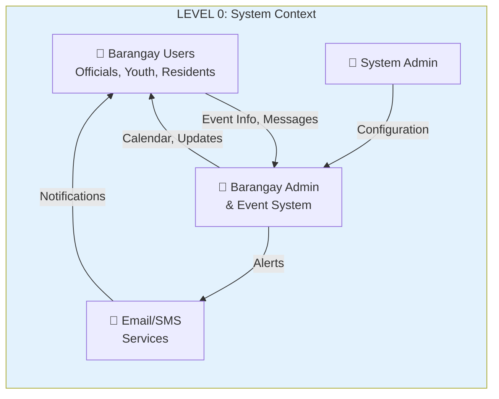
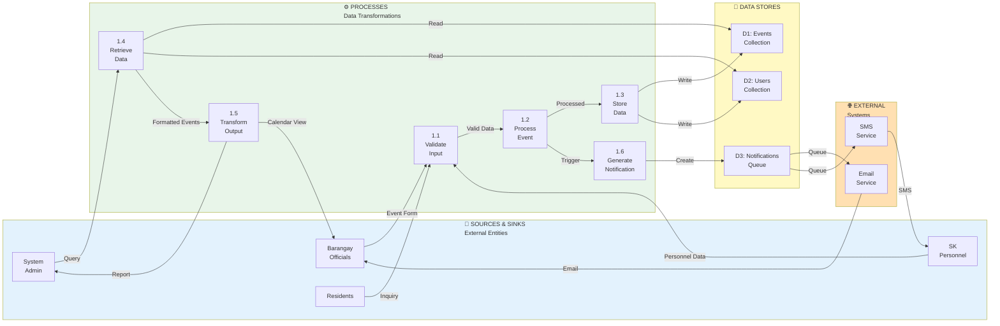
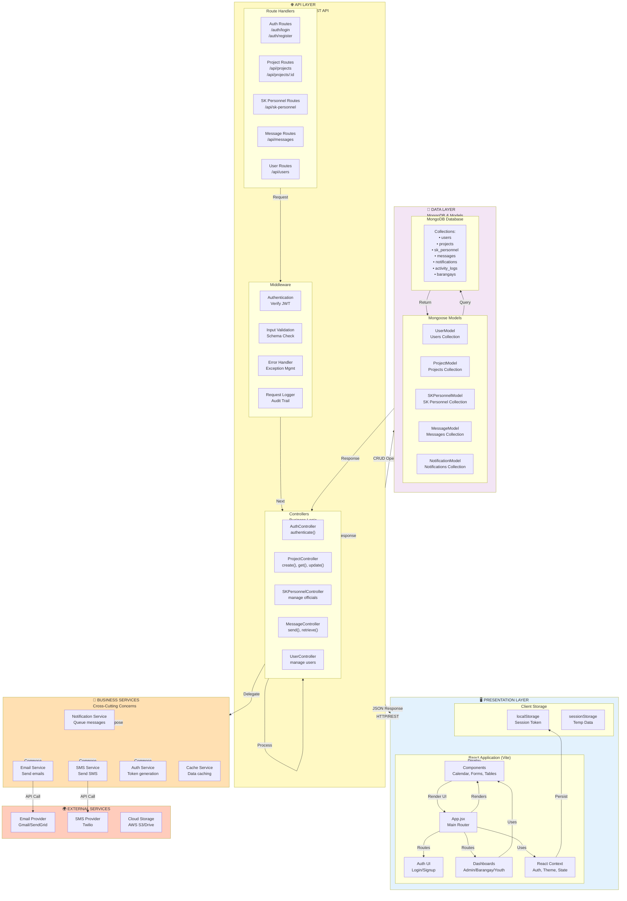
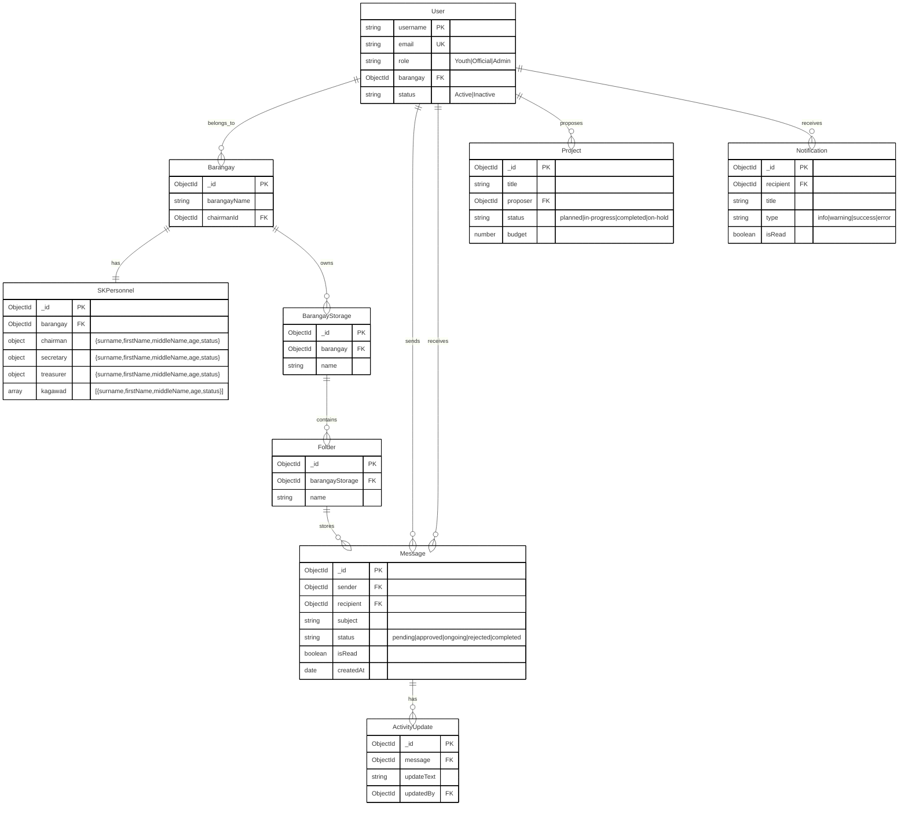

# System Diagrams - Complete Collection

This file contains all Mermaid diagram codes for your capstone project. You can:

- Copy any code block and paste into [mermaid.live](https://mermaid.live)
- Download as PNG, SVG, or PDF
- View in VS Code with Mermaid extension

---

## 1. System Architecture Diagram (COMPRESSED)

```mermaid
graph TB
    subgraph Frontend["🖥️ FRONTEND<br/>React + Vite"]
        React["React App<br/>Components & Pages"]
        Context["Context<br/>Auth & State"]
        Storage["localStorage<br/>JWT Token"]
        React -->|Persist| Storage
        React -->|Uses| Context
    end

    subgraph Network["🌐 NETWORK<br/>HTTP/REST"]
        API["API<br/>JSON Request/Response"]
    end

    subgraph Backend["⚙️ BACKEND<br/>Node.js + Express"]
        Routes["RouteMiddlewares<br/>Auth, Projects, SK, Messages"]
        Middleware["Middleware<br/>Auth, Validation, Logging"]
        Controllers["Controllers<br/>Business Logic"]
        Services["Services<br/>Event, Personnel, Notification"]

        Routes -->|Process|
        Middleware -->|Dispatch| Controllers
        Controllers -->|Delegate| Services
    end

    subgraph Database["💾 DATABASE<br/>MongoDB"]
        Collections["Collections<br/>users, projects, messages<br/>sk_personnel, notifications<br/>barangays, activity_logs"]
        Collections
    end

    subgraph External["🌍 EXTERNAL<br/>Services"]
        Email["Email<br/>SendGrid"]
        SMS["SMS<br/>Twilio"]
        Storage_Ext["Cloud<br/>AWS S3"]
    end

    subgraph Security["🔒 SECURITY"]
        JWT["JWT Auth"]
        RBAC["Role-Based<br/>Access"]
        Encrypt["Encryption"]
    end

    Frontend -->|HTTP| Network
    Network -->|HTTP| Backend
    Backend -->|Query| Database
    Database -->|Data| Backend
    Backend -->|Response| Network
    Network -->|JSON| Frontend

    Services -->|Send| Email
    Services -->|Send| SMS
    Services -->|Upload| Storage_Ext

    Backend -->|Verify| JWT
    Backend -->|Check| RBAC
    Backend -->|Encrypt| Encrypt

    style Frontend fill:#E3F2FD
    style Network fill:#FFF9C4
    style Backend fill:#BBDEFB
    style Database fill:#F3E5F5
    style External fill:#FFE0B2
    style Security fill:#FFCCBC
```

---

## 2. Data Flow Diagram (SHORT & SIMPLE)



---

## 3. DFD Level 0 - System Context Diagram



---

## 3. DFD Level 1 - Main Processes

```mermaid
graph TB
    subgraph Level1["LEVEL 1: Main Processes"]
        subgraph EventMgmt["1.0 Event Management"]
            direction TB
            P1A["1.1 Schedule Event"]
            P1B["1.2 View Events"]
            P1C["1.3 Update Event"]
        end

        subgraph PersonnelMgmt["2.0 Personnel Management"]
            direction TB
            P2A["2.1 Manage SK Officials"]
            P2B["2.2 Manage Kagawad"]
            P2C["2.3 Generate Reports"]
        end

        subgraph CommMgmt["3.0 Communication"]
            direction TB
            P3A["3.1 Send Message"]
            P3B["3.2 View Messages"]
            P3C["3.3 Send Notifications"]
        end

        subgraph AuthMgmt["4.0 Authentication"]
            direction TB
            P4A["4.1 User Login"]
            P4B["4.2 Verify Authorization"]
            P4C["4.3 Manage Sessions"]
        end

        subgraph AdminMgmt["5.0 Admin Functions"]
            direction TB
            P5A["5.1 User Management"]
            P5B["5.2 System Monitoring"]
            P5C["5.3 Generate Analytics"]
        end
    end

    User1["👤 Users<br/>Input Requests"]
    DB1["💾 Database<br/>Event Data"]
    DB2["💾 Database<br/>Personnel Data"]
    DB3["💾 Database<br/>Message Data"]
    DB4["💾 Database<br/>User Data"]
    ExtSvc["📧 External<br/>Services"]

    User1 -->|Event Details| P1A
    User1 -->|Personnel Info| P2A
    User1 -->|Messages| P3A
    User1 -->|Login Creds| P4A

    P1A -->|Store| DB1
    P1B -->|Query| DB1
    P1C -->|Update| DB1

    P2A -->|Store| DB2
    P2B -->|Update| DB2
    P2C -->|Query| DB2

    P3A -->|Create| DB3
    P3B -->|Retrieve| DB3
    P3C -->|Trigger| ExtSvc

    P4A -->|Verify| DB4
    P4B -->|Check| DB4

    P5A -->|Manage| DB4
    P5B -->|Monitor| DB1
    P5B -->|Monitor| DB2
    P5B -->|Monitor| DB3

    P1B -->|Event List| User1
    P2C -->|Reports| User1
    P3B -->|Messages| User1
    P4C -->|Session Token| User1

    style EventMgmt fill:#C8E6C9
    style PersonnelMgmt fill:#BBDEFB
    style CommMgmt fill:#FFE0B2
    style AuthMgmt fill:#F8BBD0
    style AdminMgmt fill:#E1BEE7
```



---

## 4. DFD Level 2 - Event Process Detail



---

## 5. DFD - Multi-Layer Architecture



---

## 6. DFD - Complete Request-Response Flow

```mermaid
graph TB
    subgraph DataFlow["DATA FLOW ACROSS SYSTEM"]
        direction TB

        subgraph Step1["STEP 1: User Input"]
            User["👤 User<br/>Enters Data"]
            User -->|Form submission| FEValid["Frontend<br/>Validation"]
            FEValid -->|Valid Data| Serialize["Serialize to<br/>JSON"]
        end

        subgraph Step2["STEP 2: Request to Server"]
            Serialize -->|POST/PUT| HTTP["HTTP Request<br/>Headers + Body"]
            HTTP -->|Over Network| Server["Server<br/>Receives"]
        end

        subgraph Step3["STEP 3: Request Processing"]
            Server -->|Route Match| Router["Router<br/>Identifies Endpoint"]
            Router -->|Dispatch| Middleware["Middleware Stack<br/>Auth, Validation"]
            Middleware -->|Pass| Controller["Controller<br/>Business Logic"]
        end

        subgraph Step4["STEP 4: Data Transformation"]
            Controller -->|Prepare| Model["Mongoose Model<br/>Schema Validation"]
            Model -->|Transform| Normalize["Normalize Data<br/>for Storage"]
        end

        subgraph Step5["STEP 5: Database Operations"]
            Normalize -->|Execute| Insert["Insert/Update<br/>Query"]
            Insert -->|Write| MongoDb["MongoDB<br/>Persist Data"]
            MongoDb -->|Confirm| ConfirmWrite["Write Success"]
        end

        subgraph Step6["STEP 6: Response Generation"]
            ConfirmWrite -->|Create| RespObj["Response Object<br/>Success/Error"]
            RespObj -->|Serialize| JSON["JSON Stringify<br/>Format"]
        end

        subgraph Step7["STEP 7: Return to Client"]
            JSON -->|HTTP 200/201| HTTPResp["HTTP Response<br/>Status + Body"]
            HTTPResp -->|Over Network| ClientRx["Client<br/>Receives"]
        end

        subgraph Step8["STEP 8: Frontend Updates"]
            ClientRx -->|Parse| Parse["Parse JSON<br/>Response"]
            Parse -->|Update State| State["Update React<br/>State"]
            State -->|Trigger| Rerender["Re-render<br/>Components"]
            Rerender -->|Display| Display["Show Updated<br/>UI to User"]
        end

        subgraph Step9["STEP 9: Side Effects"]
            Rerender -->|Trigger| Notif["Send<br/>Notifications"]
            Notif -->|Queue| EmailQueue["Email Queue"]
            Notif -->|Queue| SMSQueue["SMS Queue"]
            EmailQueue -->|Process| EmailSvc["Email Service"]
            SMSQueue -->|Process| SMSSvc["SMS Service"]
            EmailSvc -->|Send| EmailExt["External<br/>Email"]
            SMSSvc -->|Send| SMSExt["External<br/>SMS"]
        end
    end

    style Step1 fill:#E8F5E9
    style Step2 fill:#FFF9C4
    style Step3 fill:#BBDEFB
    style Step4 fill:#F3E5F5
    style Step5 fill:#FFE0B2
    style Step6 fill:#F3E5F5
    style Step7 fill:#FFF9C4
    style Step8 fill:#E8F5E9
    style Step9 fill:#FFCCBC
```



---

## 7. Entity Relationship Diagram (ERD) - COMPACT A4 VERSION



### **ERD Legend & Relationships**

| Symbol   | Meaning            |
| -------- | ------------------ | ----- | ----------------- | --- | ---------------- |
| `        |                    | --    |                   | `   | One-to-One (1:1) |
| `        |                    | --o{` | One-to-Many (1:M) |
| `}o--o{` | Many-to-Many (M:M) |
| `PK`     | Primary Key        |
| `FK`     | Foreign Key        |
| `UK`     | Unique Key         |

### **Key Relationships Summary**

1. **User ↔ Barangay**: Users belong to barangays (many-to-one)
2. **Barangay ↔ SKPersonnel**: Each barangay has one SK personnel record (one-to-one)
3. **User ↔ Message**: Users send and receive messages (one-to-many)
4. **User ↔ Project**: Users can propose multiple projects (one-to-many)
5. **User ↔ Notification**: Users receive multiple notifications (one-to-many)
6. **Barangay ↔ BarangayStorage**: Barangays have storage systems (one-to-many)
7. **BarangayStorage ↔ Folder**: Storage contains folders (one-to-many)
8. **Folder ↔ Message**: Folders store attached messages (one-to-many)
9. **Message ↔ ActivityUpdate**: Messages can have activity updates (one-to-many)

### **Database Schema Overview**

- **Total Entities**: 9 main entities
- **Total Relationships**: 11 relationships
- **Primary Keys**: All entities have ObjectId \_id as PK
- **Foreign Keys**: 12 foreign key relationships
- **Database**: MongoDB with Mongoose ODM

---

## How to Download

### **Method 1: Mermaid Live Editor**

1. Go to https://mermaid.live
2. Copy any code block above
3. Paste into the editor
4. Click **Download** → Choose PNG, SVG, or PDF

### **Method 2: GitHub**

1. Create a `.md` file in your repo with these diagram codes
2. GitHub renders Mermaid diagrams automatically
3. Right-click → Save image

### **Method 3: VS Code**

1. Install **Markdown Preview Mermaid Support** extension
2. Open this file in VS Code
3. Click preview
4. Right-click diagram → Save image

---

## Summary

| Diagram              | Type                | Shows                                                          |
| -------------------- | ------------------- | -------------------------------------------------------------- |
| System Architecture  | Complete overview   | All layers: Frontend → Backend → Database → External           |
| Data Flow (SHORT)    | Simple flow         | User input → Processing → Database → Notifications             |
| DFD Level 0          | Context             | Users, System, Admin, External Services                        |
| DFD Level 1          | Main processes      | 5 major process groups (Events, Personnel, Comms, Auth, Admin) |
| DFD Level 2          | Event detail        | Detailed event process with data stores and transforms         |
| Multi-Layer DFD      | Architecture        | Frontend, API, Data, Services layers                           |
| Request-Response DFD | Flow                | Complete 9-step data journey through system                    |
| **ERD (COMPACT)**    | **Database Schema** | **9 entities, 11 relationships, A4-size friendly**             |

---

All diagrams are production-ready and document your complete capstone system!
