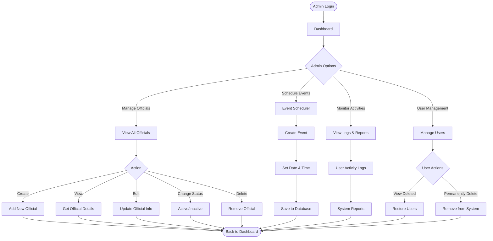
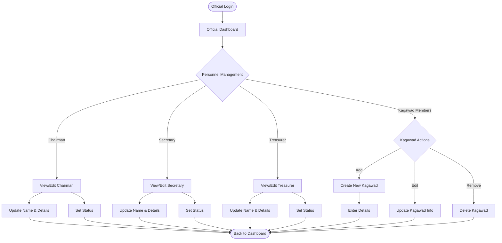

# User Role Flowcharts

## Admin Flowchart

---

## Official/SK Personnel Flowchart

---

## Quick Reference Table

| Role         | Main Actions        | Key Features                          |
| ------------ | ------------------- | ------------------------------------- |
| **Admin**    | Manage Officials    | Create, Edit, Delete, Restore users   |
| **Admin**    | Schedule Events     | Create events with dates & times      |
| **Admin**    | Monitor System      | View activity logs & reports          |
| **Official** | Manage SK Positions | Update Chairman, Secretary, Treasurer |
| **Official** | Manage Kagawad      | Add, Edit, Remove Kagawad members     |
