# System Flowchart - Capstone Project

## System Overview

This flowchart illustrates the main user flows and interactions within the Barangay Management System, including authentication, personnel management, event scheduling, and communication workflows.

---

## Main System Flowchart

```mermaid
flowchart TD
    Start([User Visits System]) --> CheckAuth{Authenticated?}

    CheckAuth -->|No| AuthFlow["<b>Authentication Flow</b>"]
    AuthFlow --> SignChoice{New User?}
    SignChoice -->|Yes| Register["📝 Register/Sign Up<br/>Create new account"]
    SignChoice -->|No| Login["🔐 Login/Sign In<br/>Verify credentials"]
    Register --> AuthCheck{Auth Success?}
    Login --> AuthCheck

    AuthCheck -->|No| ErrorAuth["❌ Authentication Failed<br/>Show error message"]
    ErrorAuth --> CheckAuth

    AuthCheck -->|Yes| Dashboard["✅ Login Successful<br/>Redirect to Dashboard"]

    CheckAuth -->|Yes| Dashboard
    Dashboard --> RoleCheck{User Role?}

    RoleCheck -->|Regular User| UserFlow["<b>User Flow</b><br/>Limited Access"]
    RoleCheck -->|SK Personnel| SKFlow["<b>SK Personnel Flow</b>"]
    RoleCheck -->|Barangay Official| OfficialFlow["<b>Official Flow</b>"]
    RoleCheck -->|Admin| AdminFlow["<b>Admin Flow</b>"]

    %% User Flow
    UserFlow --> UserDash["View Dashboard"]
    UserDash --> UserChoice{Action?}
    UserChoice -->|View Profile| UserProfile["📋 View/Edit Profile<br/>Manage personal info"]
    UserChoice -->|View Notifications| UserNotif["🔔 Receive Notifications<br/>From system/officials"]
    UserChoice -->|View Calendar| UserCal["📅 View Calendar & Events"]
    UserProfile --> UserEnd([Return to Dashboard])
    UserNotif --> UserEnd
    UserCal --> UserEnd

    %% SK Personnel Flow
    SKFlow --> SKDash["View Dashboard"]
    SKDash --> SKChoice{Action?}
    SKChoice -->|Manage Officials| ManageSK["👥 Manage SK Officials<br/>Chairman, VP, Secretary"]
    SKChoice -->|Manage Kagawad| SKKag["👫 Manage SK Kagawad<br/>Add/Edit/Delete Members"]
    SKChoice -->|Schedule Events| SKEvent["📅 Schedule Events<br/>Create & manage events"]
    SKChoice -->|Messaging| SKMsg["💬 Send/Receive Messages"]
    ManageSK --> SKValidate{Valid Changes?}
    SKKag --> SKValidate
    SKEvent --> SKValidate
    SKMsg --> SKValidate
    SKValidate -->|No| SKError["❌ Validation Error<br/>Show error message"]
    SKError --> SKChoice
    SKValidate -->|Yes| SKSave["💾 Save to Database"]
    SKSave --> SKEnd([Return to Dashboard])

    %% Official Flow
    OfficialFlow --> OffDash["View Dashboard"]
    OffDash --> OffChoice{Action?}
    OffChoice -->|Manage Officials| ManageOff["👔 Manage Officials<br/>Create/Update/View"]
    OffChoice -->|Manage Storage| OffStorage["📦 Manage Barangay Storage<br/>Files & Resources"]
    OffChoice -->|Monitor Projects| OffProj["📊 Monitor Projects<br/>Track progress"]
    OffChoice -->|Schedule Events| OffEvent["📅 Schedule Events"]
    OffChoice -->|Messaging| OffMsg["💬 Send/Receive Messages"]
    ManageOff --> OffValidate{Valid Changes?}
    OffStorage --> OffValidate
    OffProj --> OffValidate
    OffEvent --> OffValidate
    OffMsg --> OffValidate
    OffValidate -->|No| OffError["❌ Validation Error"]
    OffError --> OffChoice
    OffValidate -->|Yes| OffSave["💾 Save to Database"]
    OffSave --> OffEnd([Return to Dashboard])

    %% Admin Flow
    AdminFlow --> AdminDash["View Dashboard"]
    AdminDash --> AdminChoice{Action?}
    AdminChoice -->|Manage Users| AdminUsers["👥 Manage User Accounts<br/>Create/Edit/Delete"]
    AdminChoice -->|Manage Officials| AdminOff["👔 Manage Officials<br/>Full control"]
    AdminChoice -->|Manage SK| AdminSK["🎓 Manage SK Personnel<br/>Full control"]
    AdminChoice -->|Schedule Events| AdminEvent["📅 Schedule & Manage Events<br/>System-wide calendar"]
    AdminChoice -->|Send Notifications| AdminNotif["📢 Create & Send Notifications<br/>To all users"]
    AdminChoice -->|View Monitoring| AdminMon["📊 View Monitoring Dashboard<br/>System analytics"]
    AdminChoice -->|Settings| AdminSet["⚙️ Manage System Settings"]
    AdminUsers --> AdminValidate{Valid Changes?}
    AdminOff --> AdminValidate
    AdminSK --> AdminValidate
    AdminEvent --> AdminValidate
    AdminNotif --> AdminValidate
    AdminMon --> AdminValidate
    AdminSet --> AdminValidate
    AdminValidate -->|No| AdminError["❌ Validation Error"]
    AdminError --> AdminChoice
    AdminValidate -->|Yes| AdminSave["💾 Save to Database<br/>Broadcast Notifications"]
    AdminSave --> AdminEnd([Return to Dashboard])

    UserEnd --> LogoutChoice{Continue?}
    SKEnd --> LogoutChoice
    OffEnd --> LogoutChoice
    AdminEnd --> LogoutChoice

    LogoutChoice -->|Yes| Dashboard
    LogoutChoice -->|No| Logout["🚪 Logout<br/>Clear session"]
    Logout --> End([Session Ended])

    style Start fill:#e1f5ff
    style End fill:#ffcccc
    style Dashboard fill:#c8e6c9
    style ErrorAuth fill:#ffcccc
    style AuthCheck fill:#fff9c4
    style RoleCheck fill:#fff9c4
    style CheckAuth fill:#fff9c4
    style UserChoice fill:#b3e5fc
    style SKChoice fill:#e1bee7
    style OffChoice fill:#c8e6c9
    style AdminChoice fill:#ffe0b2
    style LogoutChoice fill:#fff9c4
    style SKValidate fill:#fff9c4
    style OffValidate fill:#fff9c4
    style AdminValidate fill:#fff9c4
    style SKSave fill:#c8e6c9
    style OffSave fill:#c8e6c9
    style AdminSave fill:#c8e6c9
```



---

## Flowchart Components

### Key Flow Stages

**1. Authentication Stage**

- User visits the system
- Check if already authenticated
- If not: Provide login/signup options
- Verify credentials against database
- On success: Redirect to dashboard

**2. Role-Based Routing**
After successful authentication, the system determines user role:

- **Regular User** - Basic access to profile and notifications
- **SK Personnel** - Management of youth officials and events
- **Barangay Official** - Management of officials, storage, and projects
- **Admin** - Full system control and monitoring

**3. Action Selection**
Each role has specific options:

- Users select from: View Profile, View Notifications, View Calendar
- SK Personnel select from: Manage Officials, Manage Kagawad, Schedule Events, Messaging
- Officials select from: Manage Officials, Manage Storage, Monitor Projects, Schedule Events, Messaging
- Admins select from: Manage Users, Manage Officials, Manage SK, Schedule Events, Send Notifications, View Monitoring, Settings

**4. Validation & Database Update**

- System validates user input
- If invalid: Display error and return to action menu
- If valid: Save changes to database
- Broadcast notifications if needed

**5. Session Management**

- User can continue to another action or logout
- On logout: Clear session and end workflow

---

## Data Flow

```
User Input → Validation → Database → Response → User Interface
    ↓             ↓            ↓         ↓
Controller  → Middleware  → Models  → View
```

### Process Flow

1. **Frontend** - User performs action (form submission, button click)
2. **Backend Controller** - Process request and validate data
3. **Middleware** - Check authentication and authorization
4. **Database** - Store/retrieve data (MongoDB)
5. **Response** - Send result back to frontend
6. **Frontend** - Update UI and display feedback

---

## Decision Points

| Decision       | Options                | Outcome                               |
| -------------- | ---------------------- | ------------------------------------- |
| Authenticated? | Yes / No               | Proceed to Dashboard / Show Auth Flow |
| New User?      | Yes / No               | Show Register / Show Login            |
| Auth Success?  | Yes / No               | Redirect to Dashboard / Show Error    |
| User Role?     | User/SK/Official/Admin | Route to appropriate flow             |
| Valid Changes? | Yes / No               | Save to DB / Show Error               |
| Continue?      | Yes / No               | Return to Dashboard / Logout          |

---

## System Workflows

### 🔐 Authentication Workflow

```
Start → No Auth? → Choose: Register/Login → Verify → Success? → Dashboard
         ↑                                    ↓          ↓
         └─────────────────────────────── Error ───────┘
```

### 👤 User Workflow

```
Dashboard → Choose Action:
  ├─ View Profile → Edit Info → Save → Dashboard
  ├─ View Notifications → Read Messages → Dashboard
  └─ View Calendar → View Events → Dashboard
```

### 🎓 SK Personnel Workflow

```
Dashboard → Choose Action:
  ├─ Manage Officials → Edit Details → Validate → Save → Dashboard
  ├─ Manage Kagawad → CRUD Operations → Validate → Save → Dashboard
  ├─ Schedule Events → Create Event → Validate → Save → Dashboard
  └─ Messaging → Send/Receive → Save → Dashboard
```

### 👔 Official Workflow

```
Dashboard → Choose Action:
  ├─ Manage Officials → CRUD Operations → Validate → Save → Dashboard
  ├─ Manage Storage → Upload/Manage Files → Save → Dashboard
  ├─ Monitor Projects → View Progress → Track Updates → Dashboard
  ├─ Schedule Events → Create Event → Save → Dashboard
  └─ Messaging → Send/Receive → Save → Dashboard
```

### 👨‍💼 Admin Workflow

```
Dashboard → Choose Action:
  ├─ Manage Users → CRUD Users → Validate → Save → Notify Users → Dashboard
  ├─ Manage Officials → Full Control → Save → Dashboard
  ├─ Manage SK Personnel → Full Control → Save → Dashboard
  ├─ Schedule Events → System-wide Events → Save → Dashboard
  ├─ Send Notifications → Broadcast Messages → Send → Dashboard
  ├─ View Monitoring → Analytics & Reports → Dashboard
  └─ Settings → System Configuration → Save → Dashboard
```

---

## Technology Stack by Flow Stage

| Flow Stage       | Backend                | Frontend                 | Database                |
| ---------------- | ---------------------- | ------------------------ | ----------------------- |
| Authentication   | auth.js middleware     | Signin.jsx, Signup.jsx   | userModel               |
| Authorization    | requireAuth, adminOnly | RequireAuth, RequireRole | N/A                     |
| Role Routing     | Controllers            | Layout.jsx               | N/A                     |
| User Management  | userController         | various pages            | userModel               |
| SK Personnel     | SKPersonnelController  | SkOfficial.jsx           | SKPersonnelModel        |
| Events           | MessageController      | EventScheduler.jsx       | Messages/ActivityUpdate |
| Notifications    | NotificationController | Toast.jsx                | NotificationModel       |
| Data Persistence | Models                 | All components           | MongoDB                 |

---

## Error Handling

The flowchart includes validation and error handling at key points:

1. **Authentication Errors** - Invalid credentials show error message
2. **Validation Errors** - Invalid input returns to action menu with error message
3. **Authorization Errors** - Unauthorized access denied
4. **Database Errors** - Operation failures trigger error notifications

---

## Notes

- 🎨 **Color Coding**: Blue (Start/User), Yellow (Decisions), Green (Success), Red (Errors), Orange (Admin)
- 📊 **Decision Diamonds**: Show conditional branching logic
- 💾 **Database Operations**: All actions that modify state include validation
- 📢 **Notifications**: Admin actions that affect others trigger notifications
- 🔄 **Session Management**: Users can repeat actions or logout at completion
